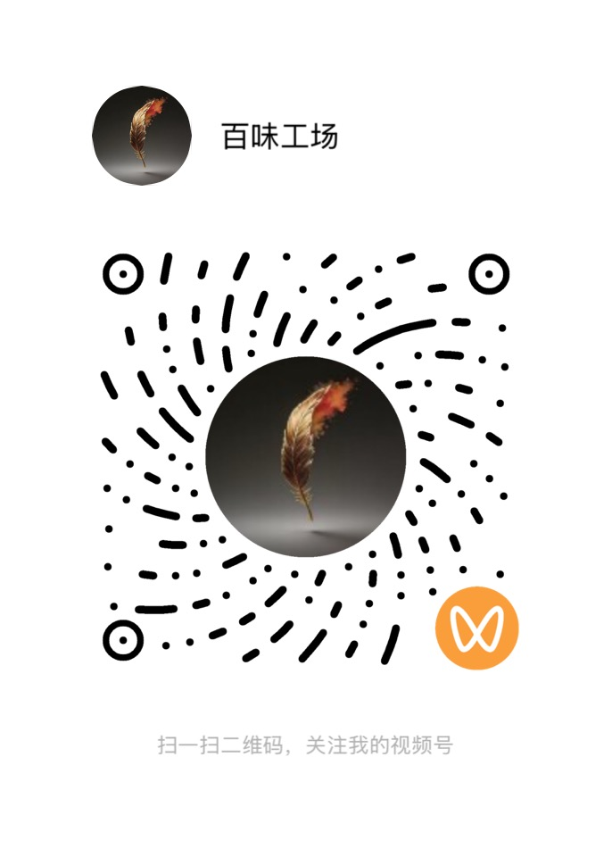

# 关于作者

你好，我是朱晓宇（笔名尧舜禹）。这是我的个人网站，登载的都是我的原创作品。我会持续更新写作动态，欢迎你常来看看。

我会公开部分作品的免费章节，但出于版权考虑，可能无法将全部内容免费公开。说实话，作为一个致力于长久创作的写作者，能先生存下去，才能一直写下去。因此书稿完成后，我会尝试付费阅读等方式获得收益，而最重要的——作品的完整版权，将由我自己做主。

当然，为扩大读者群，让更多喜欢这些文字的人有机会读到，我也会在各平台发布免费章节以增加曝光，但最完整的作品内容，都会更新在这里。敬请期待。

## 我的创作
我是一个刚刚走入写作的中年人，起步虽晚，但兴趣甚广，为自己规划的写作版图也很大。目前正在写作和陆续规划的作品包括：
- **「裂缝」系列**：横跨理论、应用与文学叙事的系列作品。
- **「神话」系列**：覆盖华夏诸神体系的“天下神祇”系列作品。
- **「思想」系列**：以叙事方式重述人类思想脉络的系列作品。
- **「喜剧」系列**：聚焦观念喜剧的“人间卧龙凤雏”系列作品。
- 其他作品陆续更新中。

## 我的理念
我相信文字的力量。在这个信息过载的时代，我试图通过系统性的写作，在裂缝中寻找光，用文字构建一个有序的、可供反复进入的思考空间，让言说和叙事成为生活和世界的一种可能。

## 联系与关注
- **作品官网**：[https://book.ihuawin.com](https://book.ihuawin.com)
- **公众号**：百味工厂
  
- **视频号**：百味工场
  
- **邮箱**：taolihusheng@qq.com

## 版权声明
本网站所有内容均为本人原创。
未来商业版权将由「北京华文声远文化传媒有限公司」负责运营。
未经授权，禁止转载、复制、改编或用于人工智能训练。